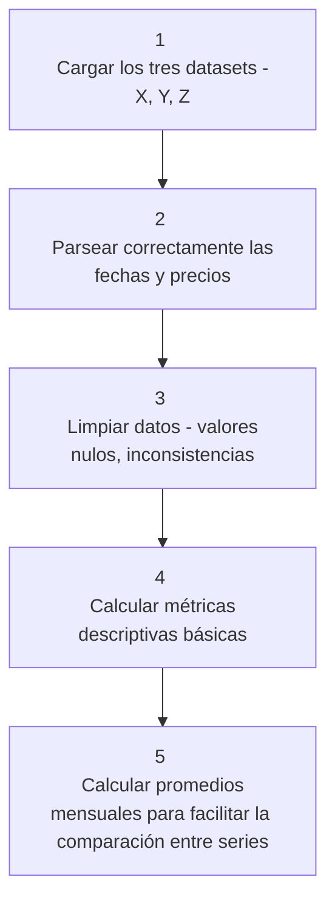

# Estimación de Costos de Equipo para Proyectos de Construcción

Una empresa constructora planifica un proyecto de 36 meses y requiere estimar el costo de dos equipos clave cuyos precios dependen de las materias primas que los componen (X, Y, Z). Este proyecto desarrolla una metodología clara y reproducible para la estimación de costos basada en datos históricos de precios.

## Objetivos

- Transformar datos de materias primas en estimaciones realistas de costos
- Construir una metodología reproducible para la estimación
- Analizar la sensibilidad de los costos ante variaciones en las materias primas

## Categorías

- Tech en Construcción
- Analítica Predictiva para la Toma de Decisiones

## Composición de los Equipos

- **Equipo 1**: 20% materia prima X + 80% materia prima Y
- **Equipo 2**: 33.3% materia prima X + 33.3% materia prima Y + 33.3% materia prima Z

## Metodología

### 1. Análisis Exploratorio

### 2. Ventana de Referencia
Se utiliza una ventana común de 12 meses para estimar costos base, considerando que es la más representativa del nivel actual y cubre un ciclo anual completo.

### 3. Modelado

- Extracción de parámetros estadísticos (media, desviación estándar, percentiles)
- Cálculo de costos base y bandas de incertidumbre
- Análisis de sensibilidad (±10% por materia prima)
- Generación de series mensuales

## Resultados

### Costos Estimados

Se establece los costos base de los equipos como:
- Equipo 1: **$25,337.28**
- Equipo 2: **$11,340.73**

### Análisis de Sensibilidad

**Impacto de variaciones del ±10% en materias primas:**

| Escenario | Equipo 1 (Δ%) | Equipo 2 (Δ%) |
|-----------|---------------|---------------|
| X +10% | +0.01% | +0.02% |
| Y +10% | +9.99% | +9.30% |
| Z +10% | 0.00% | +0.67% |
| X -10% | -0.01% | -0.02% |
| Y -10% | -9.99% | -9.30% |
| Z -10% | 0.00% | -0.67% |

La materia prima Y tiene el mayor impacto en ambos equipos, siendo crítica para el Equipo 1 (~10% de variación) y significativa para el Equipo 2 (~9.3% de variación).

## Estructura de Datos

El proyecto trabaja con tres archivos CSV, uno por cada materia prima (X, Y, Z), conteniendo:
- `Date`: fecha de registro
- `Price`: precio de la materia prima

## Supuestos y Limitaciones

- No se cuenta con información sobre proveedores, condiciones de entrega ni costos adicionales
- No se incorporan factores externos como inflación o disponibilidad de materias primas
- Los precios históricos se utilizan como base para proyecciones futuras
- Primera versión enfocada en precisión de estimación, no en optimización de recursos

## Próximos Pasos

- Incorporar análisis de proveedores y optimización de recursos
- Integrar variables macroeconómicas (inflación, disponibilidad)
- Desarrollo de modelos predictivos avanzados

---

**Nota**: Para más detalles técnicos, consultar `notes.md` y `report.md`.

---

## Contacto 
Puedes escribirme al email: [nbaezhuber@gmail.com](mailto:nbaezhuber@gmail.com)