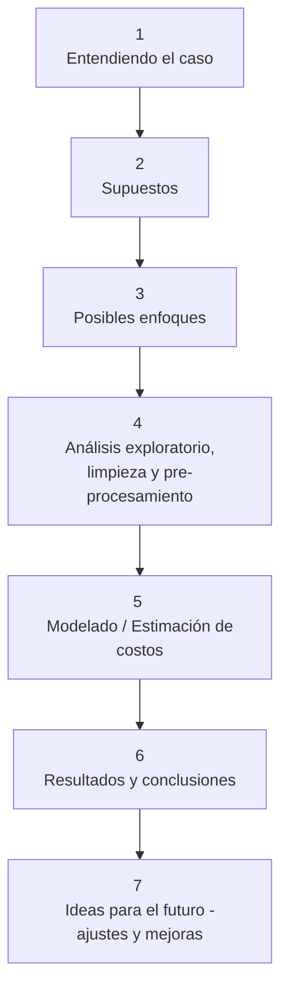
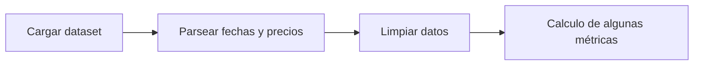
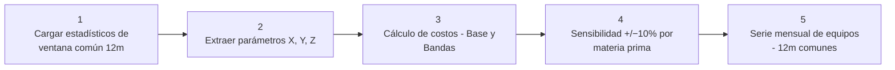
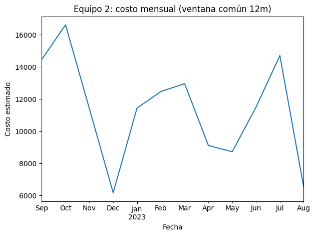
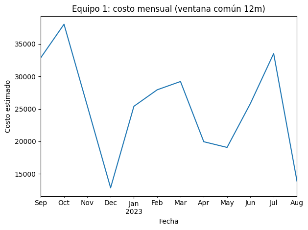

# Estimación de costos de equipo para proyectos de construcción. 

Estas son mis notas pesonales del proyecto, las cuales me ayudaron a entender, organizar, estructurar y documentar mis ideas durante el desarrollo de este. Para ver una versión  curada de estas se recomienda ver el documento `report.md`. 

## Esquema de trabajo

## 1. Entendiendo el caso. 

**Nombre del proyecto:** _Estimación de costos de equipo para proyectos de construcción_

**Descripción:** Una empresa constructora está planificando un proyecto que dura 36 meses. Contrataron a un **consultor** para realizar parte de esa planificación, ya que necesitan **estimar el costo de dos equipos clave**, cuyos precios dependen de las materias primas que los componen.

**Objetivos:** Transformar los datos de las materias primas en un estimado realista de costos.

**Categorías:** Tech en Construcción y Analítica Predictiva para la Toma de Decisiones.

**Motivación:** Poner en práctica mis conocimientos para una prueba técnica.

**Preguntas guía:** 
- ¿Cómo influyen las variaciones en el precio de las materias primas en el costo final de los equipos?
- ¿Qué información tengo disponible sobre los precios de las materias primas (X, Y, Z)?
- ¿Cuál es el rango de fechas de los datos?
- ¿Existen tendencias claras en los precios?
- ¿Qué método voy a usar para calcular los precios de X, Y y Z?
- ¿Qué riesgos existen si no se hace una buena estimación?

**Dataset:** Se cuenta con tres `csv` uno por cada materia prima (X, Y, Z).
contienen las siguientes columnas:
- Date: fecha 
- Price: precio de la materia prima en esa fecha 

>**Nota importante:** En los datos proporcionados no se cuenta con información sobre proveedores (precios por proveedor, condiciones de entrega, descuentos, garantías, etc), por lo que para esta primera versión no se trabajará en el segundo beneficio esperado, el cual trata sobre optimización de recursos.

## 2. Supuestos 
### Información con la que cuento 
Los datos disponibles para el análisis corresponden a los precios históricos de las materias primas X, Y y Z.

No se cuenta con información sobre proveedores, condiciones de entrega, calidad de servicio ni costos adicionales de transporte o mantenimiento.

### Relaciones de la composición de los equipos
- El Equipo 1 se estima con base en un 20% del precio de la materia prima X y un 80% de la materia prima Y.

- El Equipo 2 se compone en partes iguales de X, Y y Z (o sea, 33.3% cada una).

### Horizonte de planeación 

El proyecto tiene una duración de 36 meses. Se asume que los precios de las materias primas históricas pueden servir como base para proyectar o estimar los costos durante este horizonte. 

### Factores externos que se excluyen 

No se incorporan variables externas como inflación, disponibilidad de materias primas ni algún otro tipo de evento económico, aunque en un análisis real podrían tener un impacto significativo.

> **Nota importante:** El objetivo/beneficio esperado es sobre la **precisión** en la estimación de costos, sin embargo en esta primera versión priorizaré construir una metodología clara y reproducible para la estimación de los costos que pueda servir como base. 

## 3. Posibles enfoques 

### ¿Qué significa estimar el costo en este problema? 
Para este caso estimar el costo significa **calcular un valor de referencia para cada uno de los equipos**, esto a partir de las materias primas que lo componen. La estimación se puede enetnder mediante el siguiente flujo:

## 4. Análisis exploratorio - Limpieza y preprocesamiento 

Para esta parte del proyecto se llevará a cabo el siguiente esquema en código

despues se va a calcular un **promedio por mes para poder comparar las series**

**Ventana de referencia.** Se usa una ventana común de 12 meses para estimar el costo base por materia prima, por ser la más representativa del nivel actual y cubrir un ciclo anual completo.

## 5. Modelado - Estimación de costos

En esta sección se usó la ventana común de 12 meses (X, Y, Z) para estimar costos base de los equipos, bandas de incertidumbre y sensibilidad. Siguiendo el siguiente esquema en código

## 6. Resultados y conclusiones 

### Costos Base de los Equipos

|Equipo  |Base (media 12m)|Bajo (media±σ)|Alto (media±σ)|Bajo (P25)|Alto (P75)|
|--------|----------------|--------------|--------------|----------|----------|
|Equipo 1|25337.28        |17581.39      |33093.18      |19730.43  |30129.56  |
|Equipo 2|11340.73        |8071.66       |14609.8       |8980.09   |13358.45  |

Se establece los costos base de los equipos como:
- Equipo 1: **$25,337.28**
- Equipo 2: **$11,340.73**
### Bandas de Incertidumbre
Las bandas te muestran el rango probable de variación. Tenemos que para el equipo 1 el valor alto(escenario pesimista) es de **$33,093.18**, mientras que el optimista es de **$17,581.39**, teniendo un rango de variación de **$15,511.79**, que representa el **61%** del costo base. También se calculó la banda P25–P75 que representa una banda más estreña y con respecto al precio base tiene un ancho de **41%**
Por otro lado para el equipo 2 el valor alto(escenario pesimista) es de **$14,609.80**, mientras que el optimista es de **$8,071.66**, teniendo un rango de variación de **$6,538.14**, que representa el **58%** del costo base. Mientras que la banda P25-P75 es de un **39%** del costo base. 

Teniendo así que ambos equipos tienen una incertidumbre considerable. El Equipo 1 es más volátil en términos absolutos, lo que significa que hay más riesgo financiero asociado con su compra.

### Análisis de Sensibilidad: ¿Qué materia prima importa más?

|Escenario|Equipo 1 (abs)|Equipo 1 (Δ%)|Equipo 2 (abs)|Equipo 2 (Δ%)|
|---------|--------------|-------------|--------------|-------------|
|X +10%   |25338.95      |0.01         |11343.51      |0.02         |
|Y +10%   |27869.34      |9.99         |12395.75      |9.3          |
|Z +10%   |25337.28      |0.0          |11416.99      |0.67         |
|X -10%   |25335.61      |-0.01        |11337.94      |-0.02        |
|Y -10%   |22805.22      |-9.99        |10285.7       |-9.3         |
|Z -10%   |25337.28      |0.0          |11264.46      |-0.67        |

De acuerdo a estos resultados se infiere que la materia prima que más influye en los precios de ambos equipos es **Y** 
- Equipo 1: un cambio del 10% en Y genera un cambio del ~10% en el costo total
- Equipo 2: un cambio del 10% en Y genera un cambio del ~9.3% en el costo total

### Tendencias Mensuales

|Date    |Equipo 1|Equipo 2|
|--------|--------|--------|
|2022-09-01|32867.465|14460.506|
|2022-10-01|38028.069|16615.898|
|2022-11-01|25467.479|11412.458|
|2022-12-01|12855.268|6173.348|
|2023-01-01|25401.473|11432.162|
|2023-02-01|27940.100|12468.179|
|2023-03-01|29215.721|12956.227|
|2023-04-01|19949.874|9111.056|
|2023-05-01|19073.330|8723.340|
|2023-06-01|25821.469|11504.603|
|2023-07-01|33521.784|14704.787|
|2023-08-01|13905.369|6526.187|

De las tendencias mensuales que van de septiembre del 2022 a agosto de 2023 se observa que: 
- Equipo 1
    - Mínimo: $12,855.26 (diciembre 2022)
    - Máximo: $38,028.07 (octubre 2022)
    - Diferencia: casi 3 veces más caro en el peor momento
- Equipo 2
    - Mínimo: $6,173.35 (diciembre 2022)
    - Máximo: $16,615.90 (octubre 2022)
    - Diferencia: 2.7 veces más caro en el peor momento

> Nota: Ambos equipos tuvieron picos en octubre 2022 y valles en diciembre 2022. Esto podría sugerir que existe alguna estacionalidad o evento externo que afecta a las tres materias primas simultáneamente.

## 7. Ideas para el futuro - ajustes y mejoras

- Incorporar análisis de proveedores y optimización de recursos
- Integrar variables macroeconómicas (inflación, disponibilidad)
- Desarrollo de modelos predictivos avanzados