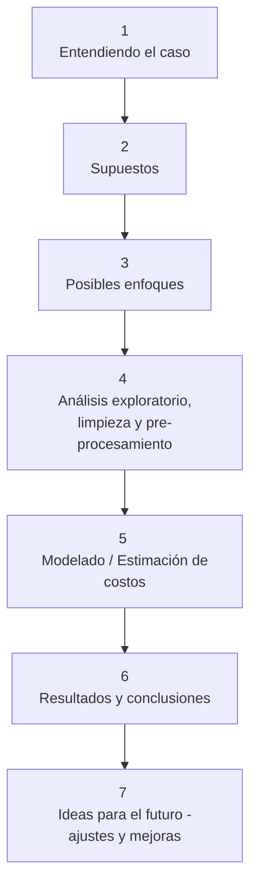

# Estimación de costos de equipo para proyectos de construcción. 

Estas son mis notas pesonales del proyecto, las cuales me ayudaron a entender, organizar, estructurar y documentar mis ideas durante el desarrollo de este. Para ver una versión  curada de estas se recomienda ver el documento `report.md`. 

## Esquema de trabajo

## 1. Entendiendo el caso. 

**Nombre del proyecto:** _Estimación de costos de equipo para proyectos de construcción_

**Descripción:** Una empresa constructora está planificando un proyecto que dura 36 meses. Contrataron a un **consultor** para realizar parte de esa planificación, ya que necesitan **estimar el costo de dos equipos clave**, cuyos precios dependen de las materias primas que los componen.

**Objetivos:** Transformar los datos de las materias primas en un estimado realista de costos.

**Categorías:** Tech en Construcción y Analítica Predictiva para la Toma de Decisiones.

**Motivación:** Poner en práctica mis conocimientos para una prueba técnica.

**Preguntas guía:** 
- ¿Cómo influyen las variaciones en el precio de las materias primas en el costo final de los equipos?
- ¿Qué información tengo disponible sobre los precios de las materias primas (X, Y, Z)?
- ¿Cuál es el rango de fechas de los datos?
- ¿Existen tendencias claras en los precios?
- ¿Qué método voy a usar para calcular los precios de X, Y y Z?
- ¿Qué riesgos existen si no se hace una buena estimación?

**Dataset:** Se cuenta con tres `csv` uno por cada materia prima (X, Y, Z).
contienen las siguientes columnas:
- Date: fecha 
- Price: precio de la materia prima en esa fecha 

**Nota importante:** En los datos proporcionados no se cuenta con información sobre proveedores (precios por proveedor, condiciones de entrega, descuentos, garantías, etc), por lo que para esta primera versión no se trabajará en el segundo beneficio esperado, el cual trata sobre optimización de recursos.

## 2. Supuestos 
### Información con la que cuento 
### ¿Qué significa estimar el costo en este problema? 
### Lista de supuestos 

## 3. Posibles enfoques 

