# Estimación de costos de equipo para proyectos de construcción. 

Estas son mis notas pesonales del proyecto, las cuales me ayudaron a entender, organizar, estructurar y documentar mis ideas durante el desarrollo de este. Para ver una versión  curada de estas se recomienda ver el documento `report.md`. 

## Esquema de trabajo

```mermaid
    graph TD 
        A[Entendiendo el caso]-->B[Supuestos]
        B-->C[Posibles enfoques]
        C-->D[Análisis exploratorio, limpieza y pre-procesamiento]
        D-->E[...]
```

