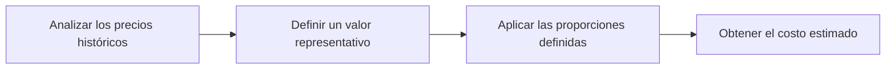
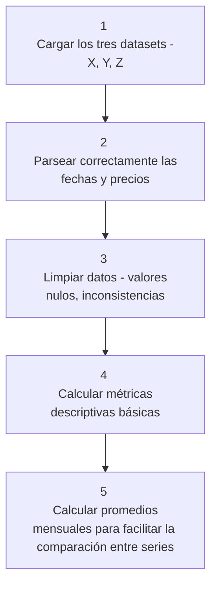

# Estimación de Costos de Equipo para Proyectos de Construcción

## 1. Explicación del Caso

Una empresa constructora se encuentra en la fase de planificación de un proyecto con duración estimada de 36 meses. Como parte de esta planificación, se requiere estimar el costo de dos equipos clave necesarios para la ejecución del proyecto. La particularidad de estos equipos es que sus precios dependen directamente de las materias primas que los componen.

El desafío consiste en transformar los datos históricos de precios de tres materias primas (X, Y, Z) en estimaciones realistas y fundamentadas de los costos de ambos equipos, considerando que cada equipo tiene una composición específica:

- **Equipo 1**: Compuesto por 20% de materia prima X y 80% de materia prima Y
- **Equipo 2**: Compuesto por partes iguales de las tres materias primas (33.3% X, 33.3% Y, 33.3% Z)

### Objetivos del Proyecto

El objetivo principal es desarrollar una metodología clara, reproducible y fundamentada que permita:

1. Obtener un costo base estimado para cada equipo
2. Establecer bandas de incertidumbre para la toma de decisiones
3. Identificar qué materias primas tienen mayor impacto en los costos finales
4. Proporcionar información útil para la gestión de riesgos del proyecto

### Preguntas Guía

- ¿Cómo influyen las variaciones en el precio de las materias primas en el costo final de los equipos?
- ¿Qué información está disponible sobre los precios históricos?
- ¿Existen tendencias claras en los precios?
- ¿Qué riesgos existen si no se hace una buena estimación?

---

## 2. Supuestos

Para desarrollar este análisis de manera efectiva, se establecieron los siguientes supuestos fundamentales:

### Información Disponible

Los datos disponibles corresponden únicamente a los precios históricos de las materias primas X, Y y Z. Cada dataset contiene:
- Fecha de registro
- Precio de la materia prima en dicha fecha

**Limitación importante**: No se cuenta con información sobre proveedores específicos, condiciones de entrega, descuentos por volumen, garantías, calidad de servicio ni costos adicionales de transporte o mantenimiento.

### Composición de los Equipos

Se asume que las proporciones establecidas para cada equipo son fijas y representan la realidad:

- Equipo 1: 20% X + 80% Y
- Equipo 2: 33.3% X + 33.3% Y + 33.3% Z

### Horizonte de Planificación

El proyecto tiene una duración de 36 meses. Se asume que los patrones históricos de precios pueden servir como base razonable para proyectar y estimar costos durante este período.

### Factores Externos Excluidos

Para esta primera versión del análisis, no se incorporan:
- Variables macroeconómicas como inflación
- Disponibilidad o escasez de materias primas
- Eventos económicos extraordinarios
- Estacionalidad específica del sector construcción
- etc

Si bien estos factores pueden tener impacto significativo en un análisis real, se excluyen para mantener el enfoque en la metodología base.

### Enfoque de esta Versión

Esta primera versión prioriza construir una metodología clara y reproducible para la estimación de costos que pueda servir como base para análisis futuros más complejos. 

---

## 3. Formas de Abordar el Problema

### Definición: ¿Qué Significa Estimar el Costo?

Para este caso específico, estimar el costo significa calcular un valor de referencia para cada equipo a partir de las materias primas que lo componen. El proceso de estimación sigue el siguiente flujo lógico:

### Metodología Implementada

#### Fase 1: Análisis Exploratorio y Preparación de Datos

El proceso comienza con la carga, limpieza y preparación de los datos:

#### Fase 2: Selección de Ventana de Referencia

Se utiliza una **ventana común de 12 meses** para todas las materias primas. Esta decisión se fundamenta en:

- Representa el nivel más actual de precios
- Cubre un ciclo anual completo, capturando posibles variaciones estacionales
- Proporciona suficientes datos para cálculos estadísticos confiables

#### Fase 3: Cálculo de Estadísticos

Para cada materia prima en la ventana de 12 meses, se calculan:

- **Media**: valor central representativo
- **Desviación estándar**: medida de volatilidad
- **Percentiles 25 y 75**: para establecer rangos de confianza

#### Fase 4: Estimación de Costos

Con base en los estadísticos calculados, se determinan:

1. **Costo base**: usando las medias de cada materia prima y aplicando las proporciones de composición
2. **Bandas de incertidumbre**: 
   - Usando media ± desviación estándar
   - Usando percentiles (P25 - P75)
3. **Serie temporal mensual**: para visualizar la evolución histórica de los costos

#### Fase 5: Análisis de Sensibilidad

Se evalúa el impacto de variaciones del ±10% en cada materia prima individualmente, manteniendo las otras constantes. Esto permite identificar:

- Qué materias primas son más críticas
- El rango de variación esperado ante cambios en precios
- Prioridades para gestión de riesgos

---

## 4. Resultados del Análisis

### Costos Estimados Base

Con base en la ventana de 12 meses común, se obtuvieron las siguientes estimaciones:

| Equipo | Costo Base | Rango Bajo (μ-σ) | Rango Alto (μ+σ) | Rango Bajo (P25) | Rango Alto (P75) |
|--------|------------|------------------|------------------|------------------|------------------|
| **Equipo 1** | $25,337.28 | $17,581.39 | $33,093.18 | $19,730.43 | $30,129.56 |
| **Equipo 2** | $11,340.73 | $8,071.66 | $14,609.80 | $8,980.09 | $13,358.45 |

Se establece los costos base de los equipos como:
- Equipo 1: **$25,337.28**
- Equipo 2: **$11,340.73**

Las bandas te muestran el rango probable de variación. Tenemos que para el equipo 1 el valor alto(escenario pesimista) es de **$33,093.18**, mientras que el optimista es de **$17,581.39**, teniendo un rango de variación de **$15,511.79**, que representa el **61%** del costo base. También se calculó la banda P25–P75 que representa una banda más estreña y con respecto al precio base tiene un ancho de **41%**
Por otro lado para el equipo 2 el valor alto(escenario pesimista) es de **$14,609.80**, mientras que el optimista es de **$8,071.66**, teniendo un rango de variación de **$6,538.14**, que representa el **58%** del costo base. Mientras que la banda P25-P75 es de un **39%** del costo base. 

Teniendo así que ambos equipos tienen una incertidumbre considerable. El Equipo 1 es más volátil en términos absolutos, lo que significa que hay más riesgo financiero asociado con su compra.

### Análisis de Sensibilidad: Impacto de Variaciones en Materias Primas

Se evaluó el efecto de cambios del ±10% en cada materia prima:

#### Equipo 1

| Escenario | Costo Resultante | Variación % |
|-----------|------------------|-------------|
| Base | $25,337.28 | - |
| X +10% | $25,338.95 | +0.01% |
| X -10% | $25,335.61 | -0.01% |
| Y +10% | $27,869.34 | +9.99% |
| Y -10% | $22,805.22 | -9.99% |
| Z +10% | $25,337.28 | 0.00% |
| Z -10% | $25,337.28 | 0.00% |

**Conclusiones Equipo 1**:
- La materia prima Y es crítica, con impacto casi lineal (~10% de cambio = 10% en costo)
- Las materias primas X y Z tienen impacto prácticamente nulo
- Esto es consistente con la composición (80% Y, 20% X, 0% Z)

#### Equipo 2

| Escenario | Costo Resultante | Variación % |
|-----------|------------------|-------------|
| Base | $11,340.73 | - |
| X +10% | $11,343.51 | +0.02% |
| X -10% | $11,337.94 | -0.02% |
| Y +10% | $12,395.75 | +9.30% |
| Y -10% | $10,285.70 | -9.30% |
| Z +10% | $11,416.99 | +0.67% |
| Z -10% | $11,264.46 | -0.67% |

**Conclusiones Equipo 2**:
- La materia prima Y es nuevamente la más influyente (~9.3% de impacto)
- La materia prima Z tiene un impacto menor pero no despreciable (~0.67%)
- La materia prima X tiene impacto marginal (~0.02%)

### Serie Temporal de Costos (12 meses comunes)

A continuación se presenta la evolución mensual de los costos calculados:

| Fecha | Equipo 1 | Equipo 2 |
|-------|----------|----------|
| 2022-09-01 | $32,867.47 | $14,460.51 |
| 2022-10-01 | $38,028.07 | $16,615.90 |
| 2022-11-01 | $25,467.48 | $11,412.46 |
| 2022-12-01 | $12,855.27 | $6,173.35 |
| 2023-01-01 | $25,401.47 | $11,432.16 |
| 2023-02-01 | $27,940.10 | $12,468.18 |
| 2023-03-01 | $29,215.72 | $12,956.23 |
| 2023-04-01 | $19,949.87 | $9,111.06 |
| 2023-05-01 | $19,073.33 | $8,723.34 |
| 2023-06-01 | $25,821.47 | $11,504.60 |
| 2023-07-01 | $33,521.78 | $14,704.79 |
| 2023-08-01 | $13,905.37 | $6,526.19 |

De las tendencias mensuales que van de septiembre del 2022 a agosto de 2023 se observa que: 
- Equipo 1
    - Mínimo: $12,855.26 (diciembre 2022)
    - Máximo: $38,028.07 (octubre 2022)
    - Diferencia: casi 3 veces más caro en el peor momento
- Equipo 2
    - Mínimo: $6,173.35 (diciembre 2022)
    - Máximo: $16,615.90 (octubre 2022)
    - Diferencia: 2.7 veces más caro en el peor momento

### Hallazgos Clave

1. **Materia Prima Crítica**: Y es el factor dominante en los costos de ambos equipos
2. **Volatilidad Significativa**: Los costos pueden variar sustancialmente mes a mes
3. **Gestión de Riesgos**: Se recomienda enfoque especial en asegurar precios estables para la materia prima Y

---

## 5. Futuros Ajustes y Mejoras

- Incorporar análisis de proveedores y optimización de recursos
- Integrar variables macroeconómicas (inflación, disponibilidad)
- Desarrollo de modelos predictivos avanzados

---

## 6. Comentarios Finales

Este proyecto ha permitido desarrollar una metodología reproducible para la estimación de costos de equipos en proyectos de construcción basándose en el comportamiento histórico de materias primas. Los resultados proporcionan una base para la toma de decisiones y la planificación presupuestal.

